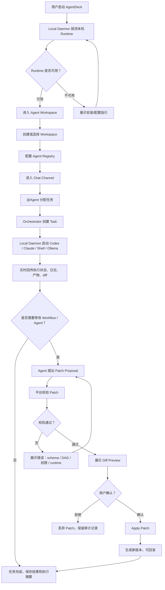
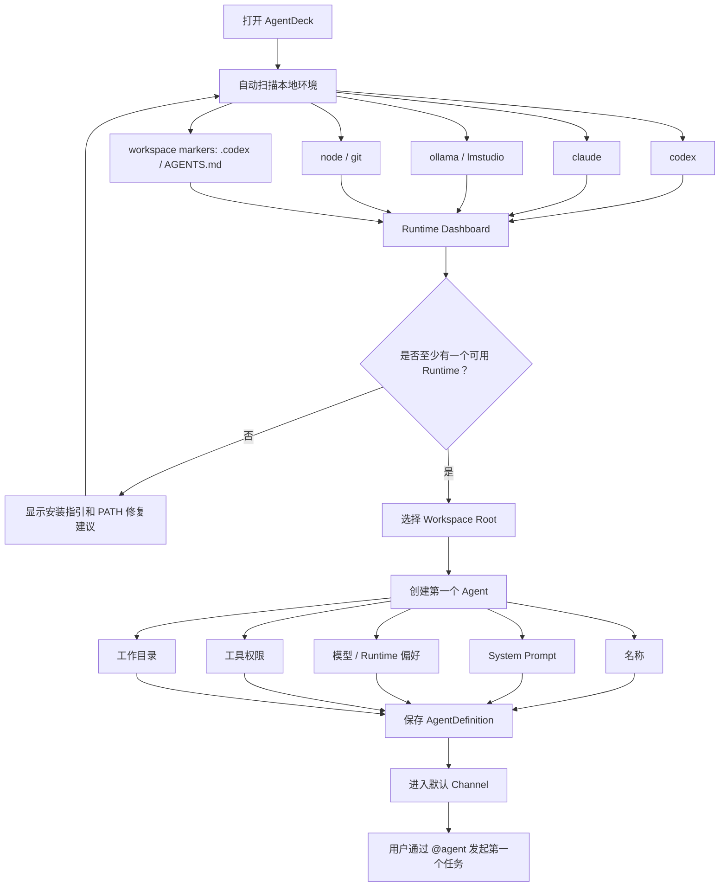
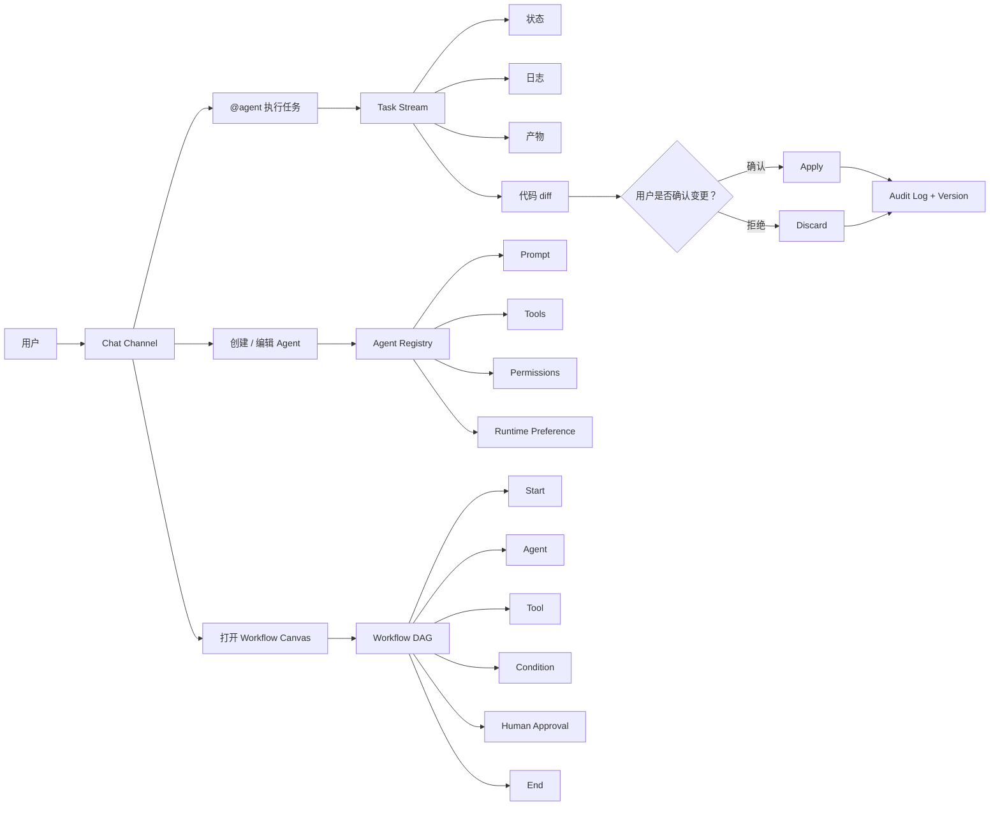
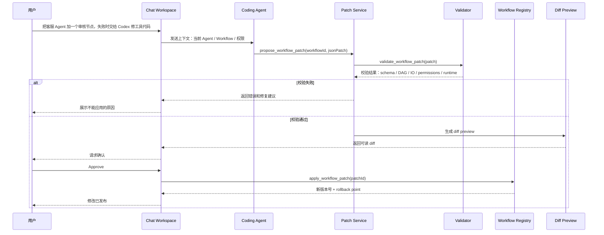
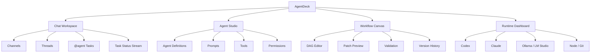

# AgentDeck Product Design

日期：2026-05-27

本文档汇总当前关于 AgentDeck 的产品定位、竞品判断、MVP 范围、用户流程、流程图和 UI 方向。后续根目录优先维护本文档，`agentdeck-project-brief.md` 保留为原始交接简报。

开发计划维护在：

- `docs/development/README.md`
- `docs/development/task-backlog.md`

## 1. 项目定位

AgentDeck 是一个面向开发者和 AI builder 的开源 local-first Agent Workspace。

它在一个 Chat 工作区中管理多个本地或云端 Agent，用低代码工作流编排它们，并允许用户通过自然语言让 Claude Code / Codex 等 coding agent 修改 Agent 配置、Workflow 和项目代码。

一句话：

```text
Local-first workspace for multi-agent coding and low-code orchestration.
```

更完整的 tagline：

```text
Open-source local-first Agent Workspace for Claude Code, Codex, and low-code agent workflows.
```

## 2. 项目命名

推荐 repo 名：`agentdeck`

选择理由：

- 短、好记，适合开源项目。
- `agent` 直接表达核心对象。
- `deck` 暗示一组 agents、工作台、控制台、编排面板。
- 不把项目锁死在 coding agent、workflow engine 或低代码平台某一个窄方向。

## 3. 产品目标

AgentDeck 的目标不是再做一个 Dify、Flowise 或 Coze Studio，而是补齐社区中尚未成熟的一块：

```text
Slock-like 多 Agent 协作空间
+ Coze-like 低代码 Agent / Workflow 编排
+ Chat 中让 Claude Code / Codex 修改 Agent 和 Workflow
+ 本地 runtime 探测与 local daemon
```

理想用户体验：

```text
用户在 Chat 中说：
“把这个客服 Agent 加一个审核节点，失败时交给 Codex 修工具代码。”

系统自动：
1. 找到 Agent / Workflow
2. 生成可视化 DAG patch
3. 校验输入输出、权限、无环
4. 调用 Claude Code / Codex 修改配置或代码
5. 展示 diff
6. 用户确认后发布
```

## 4. 社区现状与 Slock 判断

截至 2026-05-27，社区里有很多可借鉴组件，但没有一个成熟开源方案完整覆盖 AgentDeck 的设想。

| 方向 | 代表方案 | 可借鉴点 | 不足 |
| --- | --- | --- | --- |
| 多 Agent 协作空间 | Slock | Channel / DM / thread、多 Agent、local daemon、持久记忆 | 低代码编排弱，完整开源生态不明确 |
| 低代码 Agent 平台 | Coze Studio | Agent、Workflow、Plugin、RAG、可视化低代码 | 架构较重，偏平台，不是本地 coding-agent workspace |
| LLM App 平台 | Dify | 应用、Agent、Workflow、RAG、插件、API 发布 | 更偏 AI 应用发布，不偏本地代码协作 |
| 可视化 Agent 工作流 | Flowise / Langflow | Chatflow、Agentflow、可视化搭建、API/SDK/CLI | 本地 coding agent 与安全改图能力不足 |
| 多 Agent 框架 | CrewAI / AutoGen Studio / LangGraph | 多 Agent 协作、任务分发、状态图、调试 | 更偏框架或实验台，不是完整产品 |
| coding agent runtime | OpenHands / Aider / Claude Code / Codex CLI | 代码修改、命令执行、仓库任务、沙箱能力 | 缺少 Coze-like 低代码工作流产品体验 |
| 协议层 | MCP | 标准化 tools/resources/prompts，可做 Agent 修改系统的安全工具层 | 本身不是应用框架 |

### Slock 是否开源

当前调研结论：Slock.ai 还不能算已开源。

证据：

- 官网 `https://slock.ai/` 没有明确标注 open source、license、GitHub repo 或开源贡献入口。
- npm 上存在公开包 `@slock-ai/daemon`，当前 latest 为 `0.54.1`。
- npm package metadata 指向 `https://github.com/botiverse/slock.git`。
- GitHub API 对 `https://api.github.com/repos/botiverse/slock` 返回 `404 Not Found`，说明该 repo 当前不是公开可访问仓库。
- npm tarball 主要包含打包后的 `dist` 文件和 `package.json`，没有源码目录，也没有看到 license 字段。

因此 Slock 更适合被归类为：

```text
可公开使用部分 daemon/npm 包，但完整项目源码未公开；不是成熟可 fork 的开源基础。
```

这支持 AgentDeck 的策略：不要直接 fork Slock / Coze / Dify，而是借鉴它们的产品模型，自研本地 daemon、Chat 协作层和 workflow patch 安全层。

## 5. 核心差异化

AgentDeck 的核心差异应放在五点：

1. **Agent Workspace**
   类似 Slack/Slock 的 channel、thread、DM。用户可以 `@agent` 分配任务，查看 agent 执行状态和产物。

2. **Local Runtime Hub**
   自动探测并接入本机 `codex`、`claude`、`ollama`、`lmstudio`、`openhands` 等 runtime。

3. **Low-code Agent Graph**
   用可视化 DAG 定义 Agent、工具、条件、人审、代码执行、发布流程。

4. **Chat-to-Workflow Editing**
   用户在 Chat 里提出修改，系统生成 patch，校验后展示 diff，确认再发布。

5. **Coding Agent Bridge**
   Claude Code / Codex 不只是被调用执行任务，还能通过受控 MCP/API 修改 Agent 定义、workflow JSON、配置文件和项目代码。

## 6. MVP 范围

第一版只做六个能力，避免范围失控：

```text
1. Runtime Detector
   探测 codex / claude / ollama / lmstudio / node / git

2. Agent Registry
   创建 Agent：名称、system prompt、模型、工具权限、工作目录

3. Chat Workspace
   Channel + @agent mention + 任务状态流

4. Local Daemon
   本机启动 codex exec / claude / shell command，并回传事件

5. Workflow Canvas
   Start / Agent / Tool / Condition / Human Approval / End

6. Workflow Patch
   Chat 生成 workflow patch，平台 validate + preview diff + approve + apply
```

第一版不做：

- 多租户企业权限。
- 插件市场。
- 完整 RAG 平台。
- 复杂 billing。
- 云端托管执行。
- 自定义模型训练。
- 完整 Coze/Dify 级别应用发布平台。

## 7. 推荐技术架构

```text
apps/web
  Next.js / React / React Flow
  Chat、Agent Studio、Workflow Canvas、Runtime Dashboard

apps/server
  Node.js / Hono or Fastify
  Agent registry、workflow registry、conversation、audit、auth

apps/daemon
  Node.js or Rust
  Runtime detection、process runner、workspace adapter、local event stream

packages/workflow-core
  DAG schema、validator、executor、versioning、patch engine

packages/runtime-adapters
  codex adapter、claude adapter、ollama adapter、openhands adapter

packages/mcp-server
  expose tools:
    get_agent
    propose_agent_patch
    validate_workflow
    propose_workflow_patch
    apply_patch_with_approval
```

高层数据流：

```text
Web / Desktop App
  ├─ Chat: channel / DM / thread
  ├─ Agent Studio: 自定义 Agent 低代码配置
  ├─ Workflow Canvas: Coze-like DAG 编排
  └─ Runtime Monitor: 本地 Codex / Claude / Ollama / tools 状态

Backend / Control Plane
  ├─ Agent Registry: agent 定义、角色、模型、工具权限
  ├─ Workflow Registry: DAG schema、版本、发布状态
  ├─ Conversation Service: channel、消息、mentions、任务分发
  ├─ Orchestrator: 调度 agent / workflow / human approval
  ├─ Memory Service: agent 记忆、项目知识、执行摘要
  └─ Audit & Permission: 每次修改、命令、文件写入都留痕

Local Daemon
  ├─ Runtime Detector: codex / claude / ollama / lmstudio
  ├─ Process Runner: 启动 Claude Code / Codex CLI session
  ├─ Workspace Adapter: git worktree / repo / sandbox
  ├─ MCP Bridge: 暴露平台工具给 Claude/Codex
  └─ Event Stream: stdout、tool event、diff、状态回传
```

## 8. 关键数据模型

```text
AgentDefinition
  id
  name
  description
  prompt
  model
  tools
  permissions
  memoryScope
  runtimePreference
  workspaceRoot

WorkflowDefinition
  id
  version
  nodes
  edges
  variables
  permissions
  status
  createdAt
  updatedAt

Runtime
  id
  type
  path
  version
  capabilities
  health
  lastDetectedAt

Conversation
  id
  channelId
  threadId
  messages
  mentions
  taskRefs

PatchProposal
  id
  targetType
  targetId
  baseVersion
  jsonPatch
  validationResult
  approvalState
  diffPreview
```

## 9. 用户主流程



## 10. 首次使用流程



## 11. 日常核心使用流程



## 12. Chat 修改 Workflow 的安全流程

这是 AgentDeck 最关键的差异化流程。



核心原则：

- Agent 只能提出 patch。
- 平台负责 schema validate、DAG validate、权限校验和版本落库。
- 用户确认后才能 apply。
- 每次修改必须有 audit log 和 rollback version。

## 13. 用户路径梳理

| 阶段 | 用户动作 | 系统响应 | 关键产物 |
| --- | --- | --- | --- |
| 初始化 | 打开 AgentDeck | 探测 Codex / Claude / Ollama / Node / Git | Runtime 状态 |
| 建立工作区 | 选择项目目录 | 绑定 workspaceRoot，读取项目 marker | Workspace |
| 创建 Agent | 设置名称、prompt、模型、权限 | 保存 AgentDefinition | Agent Registry |
| 发起任务 | 在 Chat 中 `@agent` | 创建 task，启动本地 runtime | Task Stream |
| 查看执行 | 看日志、状态、diff、产物 | 实时事件流回传 | Execution Trace |
| 编排流程 | 打开 Workflow Canvas | 创建 Start / Agent / Tool / Condition / Human Approval / End | WorkflowDefinition |
| 自然语言改流程 | 在 Chat 中描述修改 | Coding agent 生成 patch proposal | PatchProposal |
| 审批发布 | 查看 diff 并确认 | 校验、apply、生成版本 | 新 workflow version |
| 回滚审计 | 查看历史修改 | 展示谁改了什么、何时改、为何改 | Audit Log / Rollback |

## 14. MVP 用户故事

```text
作为一个开发者，
我打开 AgentDeck 后，它能自动发现我本机的 Codex、Claude、Node 和 Git。

我可以创建一个 Code Reviewer Agent，
给它配置 system prompt、允许读取 workspace、允许运行 test/lint，
但不允许直接 push。

我在 Chat 里输入：
@reviewer 检查这个 repo 的登录模块有没有安全问题。

AgentDeck 会创建任务，
通过 Local Daemon 启动 Codex 或 Claude，
实时展示执行状态、命令、日志、代码 diff 和最终建议。

如果我说：
把这个审查流程改成：先跑测试，失败就让 Codex 修复，成功后进入人工确认。

AgentDeck 不会让模型直接改数据库，
而是生成 workflow patch，
校验 DAG、权限、输入输出和 runtime，
展示 diff，
等我确认后才应用并生成新版本。
```

## 15. UI 信息架构

AgentDeck 的 UI 应该是一个 local-first multi-agent IDE workspace，而不是 AI app builder。

用户打开后应该直接看到：

```text
左边：我的 channels / agents / workflows
中间：我正在和 agents 协作
右边：当前 agent/task/workflow 的真实状态、权限和 diff
```

推荐主结构：

```text
┌────────────────────────────────────────────────────────────┐
│ Top Bar: Workspace / Runtime Status / Search / Settings     │
├───────────────┬───────────────────────────┬────────────────┤
│ Left Sidebar  │ Main Work Area             │ Right Inspector │
│               │                            │                 │
│ Channels      │ Chat / Workflow / Agent    │ Selected Agent   │
│ Agents        │ Canvas / Runtime Dashboard │ Task Detail      │
│ Workflows     │                            │ Diff Preview     │
│ Tasks         │                            │ Permissions      │
└───────────────┴───────────────────────────┴────────────────┘
```

主导航建议：

```text
Chat
Agents
Workflows
Tasks
Runtimes
Audit
Settings
```

MVP 重点页面：

```text
P0
1. Chat Workspace
2. Runtime Dashboard
3. Agent Studio
4. Task Inspector

P1
5. Workflow Canvas
6. Workflow Patch Preview
7. Version History

P2
8. Audit Log
9. Memory
10. MCP Tool Registry
```

## 16. UI 主入口关系



## 17. 核心页面设计

### Chat Workspace

Chat 是默认首页，不是附属客服窗口。

```text
┌───────────────┬─────────────────────────────┬──────────────────┐
│ Channels      │ # product-agent             │ Task Inspector   │
│               │                             │                  │
│ # general     │ 用户: @reviewer 检查登录模块 │ Status: running  │
│ # dev         │                             │ Runtime: Codex   │
│ # support     │ Agent: 正在读取文件...       │ Permissions      │
│               │ Agent: 发现 2 个问题         │ Commands         │
│ Agents        │                             │ Diff Preview     │
│ @reviewer     │ [Approve Diff] [Reject]      │ Artifacts        │
│ @coder        │                             │                  │
│ @qa           │ 输入框: @agent ...           │                  │
└───────────────┴─────────────────────────────┴──────────────────┘
```

关键交互：

- `@agent` mention 触发任务。
- 每个 Agent 回复都能展开为 task。
- 右侧显示当前 task 的执行状态、命令、diff、审批按钮。
- Chat 消息里不要塞太多技术细节，技术细节放右侧 inspector。

### Agent Studio

Agent 配置页面要像开发者配置表单加权限面板，不要像营销型 bot builder。

```text
┌───────────────┬─────────────────────────────┬──────────────────┐
│ Agent List    │ Agent: Code Reviewer        │ Preview / Test   │
│               │                             │                  │
│ Reviewer      │ Name                        │ Test Prompt      │
│ Coder         │ Description                 │                  │
│ QA            │ System Prompt               │ Run Dry Test     │
│ Support       │ Model / Runtime Preference  │                  │
│               │ Tools                       │ Last Runs        │
│ + New Agent   │ Permissions                 │                  │
└───────────────┴─────────────────────────────┴──────────────────┘
```

Agent 表单分组：

```text
Basic
Prompt
Model & Runtime
Tools
Permissions
Workspace
Memory
```

权限 UI 要清晰表达默认最小权限：

```text
Read workspace        on
Write workspace       approval required
Run safe commands     on
Run arbitrary command approval required
Install dependencies  off
Git commit            approval required
Git push              off
Network access        approval required
```

### Workflow Canvas

Workflow 页面是 AgentDeck 的低代码核心，但 MVP 不要复杂化。

```text
┌───────────────┬─────────────────────────────┬──────────────────┐
│ Workflows     │ Canvas                      │ Node Inspector   │
│               │                             │                  │
│ Review Flow   │ Start → Run Tests           │ Node: Agent      │
│ Support Flow  │        ↓                    │ Agent: reviewer  │
│ Deploy Flow   │     Condition               │ Input Mapping    │
│               │     /       \               │ Output Mapping   │
│ + Workflow    │  Fix Code   Approval        │ Permissions      │
└───────────────┴─────────────────────────────┴──────────────────┘
```

MVP 节点：

```text
Start
Agent
Tool
Condition
Human Approval
End
```

交互重点：

- 从左侧节点库拖节点到 Canvas。
- 点击节点，右侧编辑配置。
- 保存前自动 validate。
- Chat 生成 workflow patch 时，在 Canvas 上高亮新增、删除、修改的节点。
- 用户必须点击 `Approve` 才能应用 patch。

### Runtime Dashboard

Runtime Dashboard 是 AgentDeck 和普通低代码平台的差异点之一，要做得像本地开发环境状态页。

```text
┌──────────────────────────────────────────────┐
│ Runtime Dashboard                            │
├──────────────────────────────────────────────┤
│ Codex      Ready       /usr/local/bin/codex  │
│ Claude     Ready       ~/.local/bin/claude   │
│ Ollama     Missing     Install guide         │
│ LM Studio  Missing     Install guide         │
│ Node       Ready       v20.x                 │
│ Git        Ready       2.x                   │
└──────────────────────────────────────────────┘
```

每个 runtime 展示：

```text
Status
Path
Version
Capabilities
Config detected
Warnings
```

安全要求：

- 不显示 token。
- 不展示 auth 文件原文。
- 配置文件展示必须脱敏 `token`、`secret`、`api key`、`password`。

### Task / Diff / Approval

这是产品可信度的关键。

```text
Task Header
- title
- status
- assigned agent
- runtime
- startedAt / duration

Timeline
- message
- command
- tool call
- file read/write
- diff generated
- approval requested

Diff Preview
- changed files
- workflow json patch
- before / after

Actions
- Approve
- Reject
- Request changes
- Rollback
```

## 18. Runtime Detector 设计要点

本地 runtime 探测不要只依赖 `command -v`，需要多个信号：

```text
Runtime Registry
  └─ codex
      ├─ binary candidates: codex, /Applications/Codex.app/.../codex, npm global bins
      ├─ version command: codex --version
      ├─ config paths: ~/.codex/config.toml, <project>/.codex/config.toml
      ├─ project markers: .codex/, AGENTS.md
      ├─ capabilities probe: codex --help, codex exec --help, codex mcp list
      └─ local model providers: --oss, --local-provider ollama|lmstudio
```

macOS GUI/daemon 启动时 PATH 经常不完整，探测时建议使用登录 shell：

```bash
/bin/zsh -lc 'command -v codex && codex --version'
```

本机已探测到：

```text
codex path: /Users/gaoyinrun/Library/Application Support/Herd/config/nvm/versions/node/v20.19.5/bin/codex
codex version: codex-cli 0.128.0
CODEX_HOME: /Users/gaoyinrun/.codex
claude: /Users/gaoyinrun/.local/bin/claude
code: /usr/local/bin/code
ollama: 未在 PATH 中
lmstudio: 未在 PATH 中
```

Codex runtime 状态分层：

```text
ready:
  codex binary exists + version command succeeds

configured:
  ready + ~/.codex/config.toml exists

projectActive:
  configured + 当前项目存在 .codex/ 或 AGENTS.md

localProviderReady:
  codex supports --oss + ollama/lmstudio 任一服务可访问
```

## 19. 权限模型

本地 daemon 能执行命令，所以权限是产品核心，而不是后补功能。

建议权限分级：

```text
read_workspace
  读取指定 workspace 文件

write_workspace
  写入指定 workspace 文件

run_safe_commands
  运行白名单命令，例如 test、typecheck、lint

run_arbitrary_commands
  运行任意命令，默认需要人审

network_access
  允许访问网络

install_dependencies
  允许 npm/pnpm/brew/pip 等安装依赖

git_commit
  允许创建 commit

git_push
  允许 push，默认强人审
```

默认策略：

- 新 Agent 默认只读。
- 写文件、安装依赖、push、删除文件都需要明确授权。
- 对 coding agent 使用 git worktree 或 sandbox。
- 每个 task 记录命令、stdout/stderr 摘要、diff 和审批人。

## 20. UI 视觉风格

AgentDeck 应该是：

```text
密度高
开发者友好
低装饰
强状态反馈
强调 diff / approval / runtime health
```

设计原则：

- 背景：浅色为主，支持 dark mode。
- 字体：系统字体，monospace 用于命令、路径、diff。
- 主色：不要大面积紫蓝渐变。使用中性的 gray/slate，搭配绿色表示 ready、黄色表示 warning、红色表示 blocked、蓝色表示 active。
- 卡片：少用大卡片，多用 panel、table、split view。
- 图标：Agent、Workflow、Runtime、Task、Approval 都配图标，减少文字按钮堆叠。
- 圆角：控制在 6-8px。
- 布局：像工具，不像官网。

## 21. 分阶段路线图

```text
Phase 0: 项目定义和竞品文档
  - README
  - architecture
  - security model
  - workflow schema draft
  - runtime adapter interface draft

Phase 1: Runtime Detector + Local Daemon
  - 探测 codex / claude / ollama / lmstudio / node / git
  - 本地 daemon WebSocket/SSE 事件流
  - runtime dashboard

Phase 2: Agent Registry + Chat @agent
  - 创建 Agent
  - Channel / thread / message
  - @agent mention 触发任务
  - task status stream

Phase 3: Workflow DAG + 执行器
  - Start / Agent / Tool / Condition / Human Approval / End
  - DAG validator
  - workflow versioning
  - execution trace

Phase 4: Chat 修改 Agent/Workflow
  - propose patch
  - validate patch
  - preview diff
  - human approval
  - apply + rollback

Phase 5: Memory、Audit、Plugin/MCP 市场
  - agent memory
  - knowledge attachments
  - MCP tool registry
  - examples gallery
```

## 22. 最大风险

1. **安全**
   本地 daemon 可以执行命令，必须默认最小权限、人审、审计、workspace sandbox。

2. **Workflow 被模型改坏**
   所有修改必须走 patch、schema validate、DAG validate、版本回滚。

3. **Claude/Codex API 不统一**
   需要 adapter 层，不要把平台绑定到某一个 CLI。

4. **范围过大**
   第一版不要做 RAG、插件市场、多租户、企业权限。先把本地 Agent workspace 跑通。

5. **现有平台诱惑**
   直接 fork Coze/Dify 会带来架构包袱。建议先轻量自研核心，借鉴它们的产品模型。

## 23. 开源策略

建议从第一天就按社区项目设计：

```text
License: Apache-2.0 或 MIT
Repo: monorepo

Docs:
  README.md
  docs/architecture.md
  docs/runtime-adapters.md
  docs/workflow-schema.md
  docs/security-model.md
  docs/contributing.md
  examples/
```

## 24. 参考资料

- Slock: https://slock.ai/
- Slock daemon npm package: https://www.npmjs.com/package/@slock-ai/daemon
- Coze Studio: https://github.com/coze-dev/coze-studio
- Dify: https://dify.ai/
- Flowise: https://flowiseai.com/
- Langflow: https://docs.langflow.org/
- CrewAI: https://docs.crewai.com/introduction
- AutoGen Studio paper: https://arxiv.org/abs/2408.15247
- OpenHands: https://www.openhands.one/
- Claude Code Subagents: https://code.claude.com/docs/en/sub-agents
- OpenAI Codex CLI: https://developers.openai.com/codex/cli
- Ollama Codex integration: https://docs.ollama.com/integrations/codex
- Model Context Protocol: https://modelcontextprotocol.wiki/en/introduction
